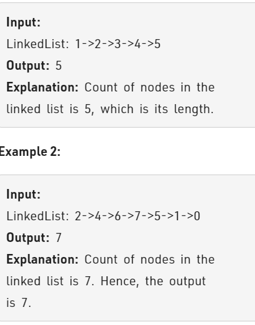

Problem Link : https://practice.geeksforgeeks.org/problems/count-nodes-of-linked-list/1

Problem Statement : Given a singly linked list. The task is to find the length of the linked list, where length is defined as the number of nodes in the linked list.



----------------------------------------------------------------------------------------

Solution1 :  Iterative 

```
class Solution
{
    public:
    //Function to count nodes of a linked list.
    int getCount(struct Node* head){
        int length = 0;
        Node*t = head;
        while(t){
            length++;
            t = t->next;
        }
        return length;
    }
};

TC : O(n)
SC : O(1)
```

Solution 2 : Recursive

```
class Solution
{
    public:
    //Function to count nodes of a linked list.
    int getCount(struct Node* head){
        if(head == NULL) return 0;
        return getCount(head->next) + 1;
    }
};

TC : O(n)
SC : O(1)
    
```