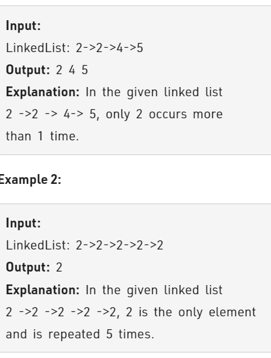

Problem Link : https://practice.geeksforgeeks.org/problems/remove-duplicate-element-from-sorted-linked-list/1

Problem Statement :Given a singly linked list consisting of N nodes. The task is to remove duplicates (nodes with duplicate values) from the given list (if exists).



-----------------------------------------------------------------------------------------------

### Solution 1 : Iterative 

```
Node *removeDuplicates(Node *head){
    if(!head || !head->next) return head;
    Node* prev = head;
    Node* curr = head->next;
    while(curr){
        if(curr->data == prev->data){
            prev->next = curr->next;
        }
        else prev = curr;
        curr = curr->next;
    }
    return head;
}

TC : O(n)
SC : O(1)
```
------------------------------------------------------------------------------------
### Solution 2 : Recursive

```
Node *removeDuplicates(Node *head){
    if(head == NULL) return head;
    head->next = removeDuplicates(head->next);
    if(head->next != NULL && head->next->data == head->data){
        Node* res = head->next;
        delete head;
        return res;
    }
    return head;
}

TC : O(n)
SC : O(1)   // ignoring stack space
```