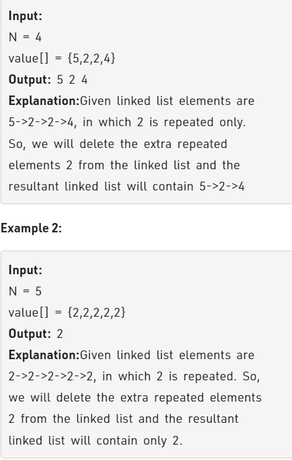

Problem Link : https://practice.geeksforgeeks.org/problems/remove-duplicates-from-an-unsorted-linked-list/1


Problem Statement  : Given an unsorted linked list of N nodes. The task is to remove duplicate elements from this unsorted Linked List.<br> When a value appears in multiple nodes, the node which appeared first should be kept, all others duplicates are to be removed.



--------------------------------------------------------------------------------------------

### Solution : Hashset

```
class Solution
{
    public:
    //Function to remove duplicates from unsorted linked list.
    Node * removeDuplicates( Node *head) {
        unordered_set<int> s;
        s.insert(head->data);
        Node* prev = head;
        Node* curr = head->next;
        while(curr){
            if(s.count(curr->data)){
                curr = curr->next;
            }
            else{
                s.insert(curr->data);
                prev->next = curr;
                prev = curr;
                curr = curr->next;
            }
        }
        prev->next = NULL;
        return head;
    }
};

TC : O(n)
SC : O(n)
```