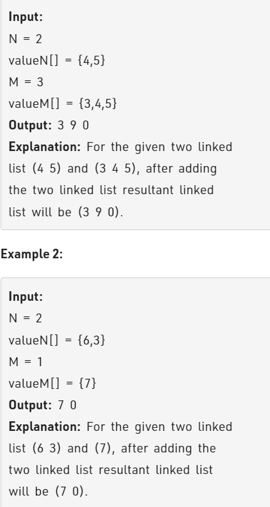

Problem Link : https://practice.geeksforgeeks.org/problems/add-two-numbers-represented-by-linked-lists/1

Problem Statement :    Given two decimal numbers represented by two linked lists of size N and M respectively.<br> The task is to return a linked list that represents the sum of these two numbers.

For example, the number 190 will be represented by the linked list, 1->9->0->null, similarly 25 by 2->5->null.<br> Sum of these two numbers is 190 + 25 = 215, which will be represented by 2->1->5->null.<br> You are required to return the head of the linked list 2->1->5->null.




_____________________________________________________________________________________________

### Solution : 

```
class Solution
{
    public:
    //Function to add two numbers represented by linked list.
    
    int size(Node* head){
        int cnt = 0;
        Node* t = head;
        while(t){
            cnt++;
            t = t->next;
        }
        return cnt;
    }
    
    int addLists(Node* first, int pv1, Node* second, int pv2, Node* &dummy){
        if(!first && !second){
            return 0;
        }
        
        int data = 0;
        if(pv1 < pv2){
            int c = addLists(first, pv1, second->next, pv2-1, dummy);
            data = second->data + c;
        }
        else if(pv1 > pv2){
            int c = addLists(first->next, pv1-1, second, pv2, dummy);
            data = first->data + c;
        }
        else{
            int c = addLists(first->next, pv1-1, second->next, pv2-1, dummy);
            data = first->data + second->data + c;
        }
        int newCarry = data/10;
        data = data%10;
        
        Node* newNode = new Node(data);
        newNode->next= dummy;
        dummy = newNode;
        return newCarry;
        
    }
    
    struct Node* addTwoLists(struct Node* first, struct Node* second){
        int sz1 = size(first);
        int sz2 = size(second);
        Node* dummy = NULL;
        int carry = addLists(first, sz1, second, sz2, dummy);
        if(carry){
            Node* newHead = new Node(carry);
            newHead->next = dummy;
            dummy = newHead;
        }
        return dummy;
    }
};
```