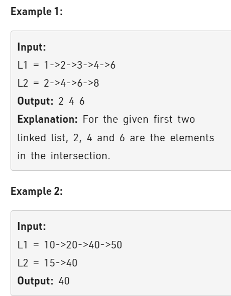

Problem Link : https://practice.geeksforgeeks.org/problems/intersection-of-two-sorted-linked-lists/1

Problem statement : Given two linked lists sorted in increasing order, create a new linked list representing the intersection of the two linked lists.<br> The new linked list should be made with its own memory the original lists should not be changed.<br>
Note: The linked list elements are not necessarily distinct.



_________________________________________________________________________________________________

### Solution

```
Node* findIntersection(Node* head1, Node* head2){
    Node* dummy = new Node(0);
    Node* prev = dummy;
    while(head1 && head2){
        if(head1->data == head2->data){
            Node* newNode = new Node(head1->data);
            prev->next= newNode;
            prev = prev->next;
            head1= head1->next;
            head2 = head2->next;
        }
        else if(head1->data < head2->data){
            head1 = head1->next;   
        }
        else{
            head2 = head2->next;
        }
    }
    return dummy->next;
}

TC : O(n+m)
SC : O(n+m)

```

