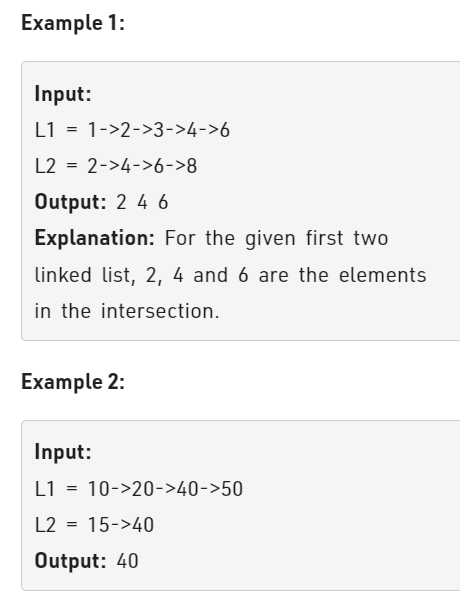

Problem Link : https://practice.geeksforgeeks.org/problems/intersection-point-in-y-shapped-linked-lists/1

Problem Statement : Given two singly linked lists of size N and M, write a program to get the point where two linked lists intersect each other.



_________________________________________________________________________________________________

### Solution : 

```
int size(Node* head){
    int cnt = 0;
    Node* t = head;
    while(t){
        cnt++;
        t = t->next;
    }
    return cnt;
}

//Function to find intersection point in Y shaped Linked Lists.
int intersectPoint(Node* head1, Node* head2){
    int sz1 = size(head1);
    int sz2 = size(head2);
    int diff = abs(sz1 - sz2);
    if(sz1 > sz2){
        for(int i=0;i<diff;i++){
            head1 = head1->next;
        }
    }
    else if(sz1 < sz2){
        for(int i=0;i<diff;i++){
            head2 = head2->next;
        }
    }
    while(head1 != head2){
        head1 = head1->next;
        head2 = head2->next;
    }
    if(head1) return head1->data ;
    return -1;
}

TC : O(n+m)
SC : O(1)

```