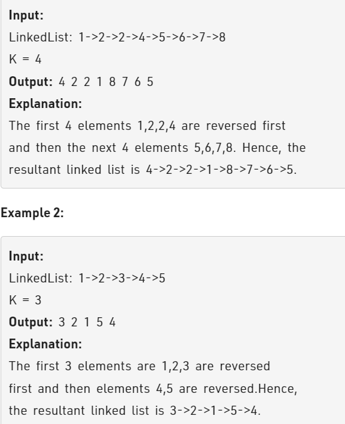

Problem Link : https://practice.geeksforgeeks.org/problems/reverse-a-linked-list-in-groups-of-given-size/1

Problem Statement : Given a linked list of size N.<br> The task is to reverse every k nodes (where k is an input to the function) in the linked list.<br> If the number of nodes is not a multiple of k then left-out nodes, in the end, should be considered as a group and must be reversed





___________________________________________________________________________________________

Solution : 

```
class Solution{
    public:
    
    struct node *reverse (struct node *head, int k){ 
        node* prev = NULL;
        node* dummy = NULL;
        node* curr = head;
        while(head){
            for(int i=0;i<k;i++){
                if(head == NULL) break;
                head = head->next;
                curr->next = dummy;
                dummy = curr;
                curr = head;
            }
            if(!prev) prev = dummy;
            else{
                node* tail = prev;
                while(tail->next) tail = tail->next;
                tail->next = dummy;
            }
            dummy= NULL;
        }
        return prev;
    }
};

TC : O(n*n)
SC : O(1)

```

---------------------------------------------------------------------------------

Solution 2: 


```
class Solution
{
    public:
    int size(node* head){
        int cnt = 0;
        node* t = head;
        while(t){
            cnt++; t = t->next;
        }
        return cnt;
    }
    struct node *reverse (struct node *head, int k){ 
        int sz = size(head);
        int times = (sz + k-1)/k;
        node* origHead = NULL;
        node* origTail = NULL;
        node* tempHead = NULL;
        node* tempTail = NULL;
        node* curr = head;
        while(times--){
            int tempK = min(k, sz);
            for(int i=0;i<tempK;i++){
                head = head->next;
                if(tempHead == NULL){
                    tempHead = tempTail = curr;
                }
                else{
                    curr->next = tempHead;
                    tempHead = curr;
                }
                curr = head;
            }
            sz -= tempK;
            if(origHead == NULL){
                origHead = tempHead;
                origTail = tempTail;
            }
            else{
                origTail->next= tempHead;
                origTail = tempTail;
            }
            tempHead = tempTail = NULL;
        }
        origTail->next = NULL;
        return origHead;
    }   
};


TC : O(n)
SC : O(1)
```