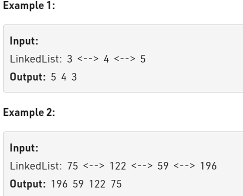

Problem Link : https://practice.geeksforgeeks.org/problems/reverse-a-doubly-linked-list/1

Problem Statement : Given a doubly linked list of n elements.<br> The task is to reverse the doubly linked list.



_____________________________________________________________________________________________

Solution : 

```
Node* reverseDLL(Node * head){
    Node* curr = head;
    Node* temp = NULL;
    while(curr){
        temp = curr->prev;
        curr->prev = curr->next;
        curr->next= temp;
        curr = curr->prev;
    }
    if(temp != NULL){
        head = temp->prev;
    }
    return head;
}

TC : O(n)
SC : O(1)
```