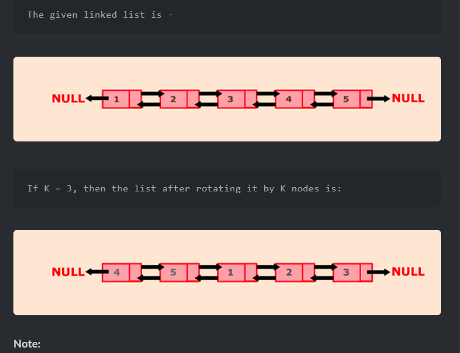

Problem Link : https://www.codingninjas.com/codestudio/problems/rotate-dll_1115782

Problem Statement : You are given a DLL with N nodes, rotate the LL counter-clockwise by K nodes. <br>
K is a positive integer and is smaller than the number of nodes in the LL that is N.
<br>

<br>

Solution : 

```
#include <bits/stdc++.h> 
/****************************************************

    Following is the class structure of the DLLNode class:

    class DLLNode {
    public:
	int data;
	Node *next;

	DLLNode(int data) {
		this->data = data;
		this->next = NULL;
		this->prev = NULL;
	}
}

*****************************************************/

DLLNode* rotateDLL(DLLNode* head, int k) {
	DLLNode* prev= NULL;
	DLLNode* curr = head;
	int cnt= 1;
	while(cnt <= k){
		prev = curr;
		curr = curr->next;
		cnt++;
	}
	DLLNode *preserve = prev->next;
	curr->prev = NULL;
	prev->next = NULL;
	while(curr->next){
		curr = curr->next;
	}
	curr->next = head;
	head->prev = curr;
	head = preserve;
	return head;
}
```