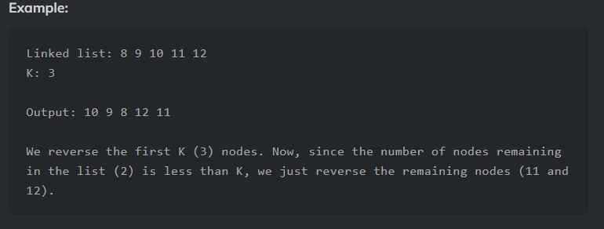

Problem Link : codingninjas.com/codestudio/problems/reverse-dll-nodes-in-groups_920399

Problem Statement : You are given a DLL of integers and a positive integer K representing the group size. <br>
Modify the LL by reversing every group of K nodes in the LL.



SOlution :

```
#include <bits/stdc++.h> 
/*********************************************************

    Following is the class structure of the Node class:

    class Node
	{
	public:
	    int data;
	    Node *next;
	    Node *prev;
	    Node(int data)
	    {
	        this->data = data;
	        this->next = NULL;
	        this->prev = NULL;
	    }
	};

************************************************************/
void pushAtBeginning(Node** head, Node* newNode){
	newNode->prev = NULL;
	newNode->next=  *head;
	if(*head){
		(*head)->prev = newNode;
	}
	*head = newNode;
}

Node* reverseDLLInGroups(Node* head, int k){	
    Node* curr = head;
	Node* next = NULL;
	Node* newHead = NULL;
	int cnt = 0;
	while(curr && cnt < k){
		next = curr->next;
		pushAtBeginning(&newHead, curr);
		curr = next;
		cnt++;
	}

	if(next){
		head->next = reverseDLLInGroups(next, k);
		head->next->prev = head;
	}
	newHead->prev = NULL;
	return newHead;
}

```