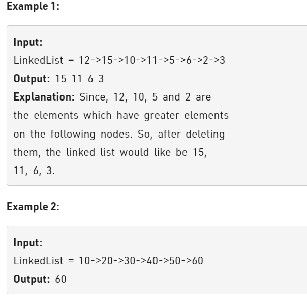

Problem Link : https://practice.geeksforgeeks.org/problems/delete-nodes-having-greater-value-on-right/1

Problem Statment : Given a singly linked list, remove all the nodes which have a greater value on their right side.



________________________________________________________________________________________________

### Solution 1 : Next Greater Element Towards Right

```
class Solution
{
    public:
    Node* reverse(Node* head){
        if(!head || !head->next) return head;
        Node* newHead = reverse(head->next);
        head->next->next = head;
        head->next = NULL;
        return newHead;
    }
    
    Node *compute(Node *head){
        head = reverse(head);
        Node* newHead  = NULL;
        Node* newTail = NULL;
        Node* curr= head;
        while(curr){
            if(newHead == NULL){
                newHead = curr;
                newTail = curr;
            }
            else{
                if(curr->data >= newTail->data){
                    newTail->next = curr;
                    newTail = newTail->next;
                }
            }
            curr= curr->next;
        }
        newTail->next = NULL;
        newHead = reverse(newHead);
        return newHead;
    }
    
};
   
```