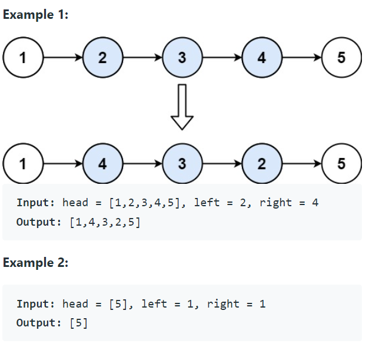

Problem Link : https://leetcode.com/problems/reverse-linked-list-ii/


Problem Statement : Given the head of a singly linked list and two integers left and right where left <= right, reverse the nodes of the list from position left to position right, and return the reversed list.


<br>

__________________________________________________________________________________________________________________________________________

Solution : 

```
class Solution {
public:
    ListNode* reverseBetween(ListNode* head, int left, int right) {
        ListNode* dummy = new ListNode(-1000);
        dummy->next = head;
        ListNode* prev = dummy;
        for(int i=0;i<left-1;i++){
            prev = prev->next;
        }
        ListNode* curr = prev->next;
        for(int i=0;i<right-left;i++){
            ListNode* forward = curr->next;
            curr->next = forward->next;
            forward->next = prev->next;
            prev->next = forward;
        }
        return dummy->next;
    }
};

```