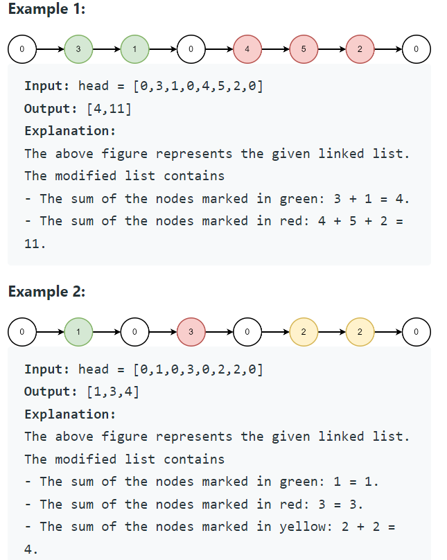

Problem Link : https://leetcode.com/problems/merge-nodes-in-between-zeros/

Problem Statement : You are given the head of a linked list, which contains a series of integers separated by 0's.<br> The beginning and end of the linked list will have Node.val == 0.<br>

For every two consecutive 0's, merge all the nodes lying in between them into a single node whose value is the sum of all the merged nodes.<br> The modified list should not contain any 0's.
<br>
Return the head of the modified linked list.


<br>

____________________________________________________________________________________________________

### Solution : Chillax

```
class Solution {
public:
    ListNode* mergeNodes(ListNode* head) {
        ListNode* curr = head->next;
        int sum = 0;
        ListNode* dummy = new ListNode(-1);
        ListNode* dummyTail = dummy;
        while(curr){
            if(curr->val == 0){
                ListNode* sumNode = new ListNode(sum);
                if(dummy == NULL){
                    dummy = dummyTail = sumNode;
                }
                else{
                    dummyTail->next = sumNode;
                    dummyTail = dummyTail->next;
                }
                sum = 0;
            }
            else{
                sum += curr->val;
            }
            curr = curr->next;
        }
        return dummy->next;
    }
};

```
