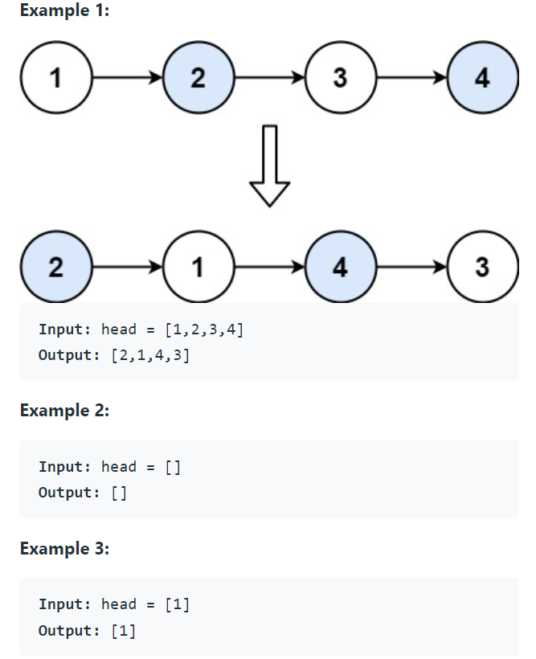

Problem Link : https://leetcode.com/problems/swap-nodes-in-pairs/

Problem Statement : Given a linked list, swap every two adjacent nodes and return its head.<br> You must solve the problem without modifying the values in the list's nodes (i.e., only nodes themselves may be changed.)<br>


_________________________________________________________________________________________________
### Solution : Iterative (Good one)

```
class Solution {
public:
    ListNode* swapPairs(ListNode* head) {
        ListNode* dummy = new ListNode(-1);
        dummy->next = head;
        ListNode* prev = dummy, *curr = head;
        while(curr && curr->next){
            ListNode* forward = curr->next;
            curr->next = forward->next;
            prev->next = forward;
            forward->next = curr;
            prev = prev->next->next;
            curr=curr->next;
        }
        return dummy->next;
    }
};
```