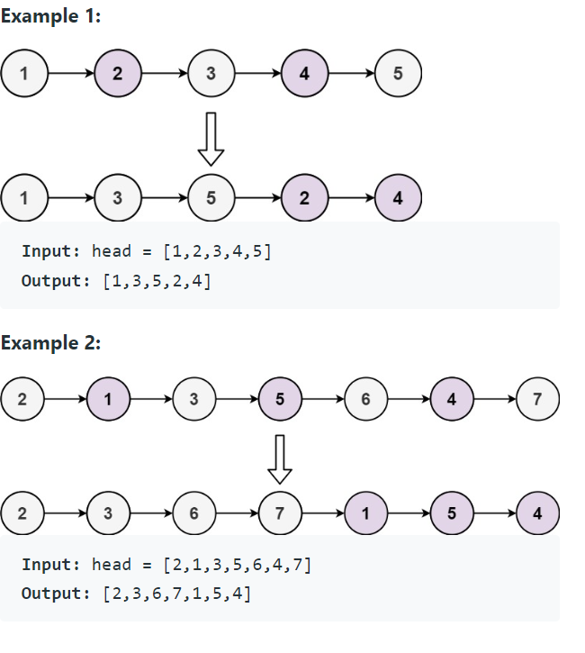

Problem Link : https://leetcode.com/problems/odd-even-linked-list/

Problem Statement : Given the head of a singly linked list, group all the nodes with odd indices together followed by the nodes with even indices, and return the reordered list.

The first node is considered odd, and the second node is even, and so on.

Note that the relative order inside both the even and odd groups should remain as it was in the input.

You must solve the problem in O(1) extra space complexity and O(n) time complexity.



_____________________________________________________________________________________________

### Solution : CHILL

```
class Solution {
public:
    ListNode* oddEvenList(ListNode* head) {
        if(!head || !head->next) return head;
        ListNode* oddHead = NULL;
        ListNode* oddTail = NULL;
        ListNode* evenHead = NULL;
        ListNode* evenTail = NULL;
        int cnt = 1;
        ListNode* curr = head;
        while(curr){
            if(cnt&1){
                if(!oddHead){
                    oddHead = oddTail = curr;
                }
                else{
                    oddTail->next = curr;
                    oddTail = oddTail->next;
                }
            }
            else{
                if(!evenHead){
                    evenHead = evenTail = curr;
                }
                else{
                    evenTail->next = curr;
                    evenTail = evenTail->next;
                }
            }
            curr = curr->next;
            cnt++;
        }
        if(!evenHead){
            return oddHead;
        }
        else{
            oddTail->next = evenHead;
            evenTail->next = NULL;
            return oddHead;
        }
    }
};
```