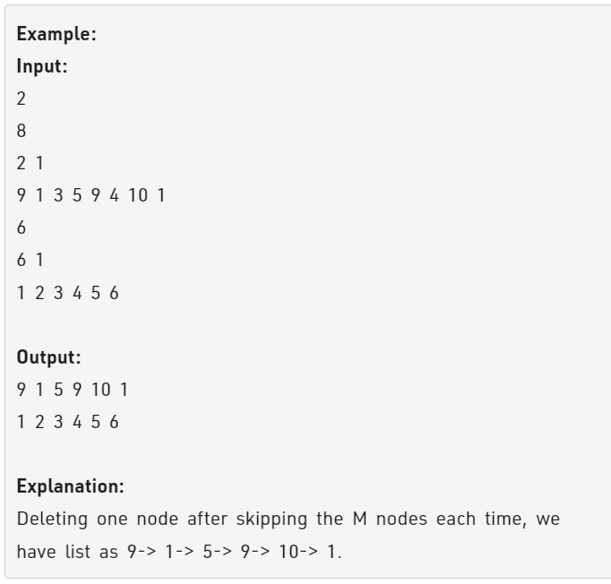

Problem Link : https://practice.geeksforgeeks.org/problems/delete-n-nodes-after-m-nodes-of-a-linked-list/1

Problem Statement : Given a linked list, delete N nodes after skipping M nodes of a linked list until the last of the linked list.

<br>

___________________________________________________________________________________________

### Solution : Dekh lo

```

class Solution
{
    public:
    void linkdelete(struct Node  *head, int M, int N){
        if(N == 0) return;
        Node* curr = head;
        while(curr){
            for(int i=0;i<M-1 && curr; i++){
                curr = curr->next;
            }
            if(curr == NULL) return;
            
            Node* forward = curr->next;
            for(int i=0;i<N && forward; i++){
                Node* temp = forward;
                forward = forward->next;
                delete(temp);
            }
            curr->next = forward;
            curr = curr->next;
        }
    }
};


```