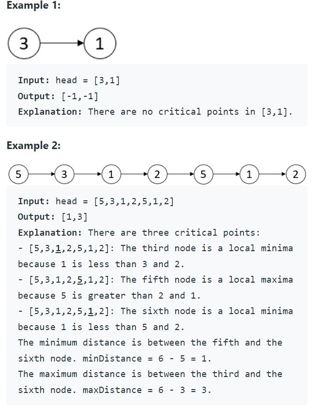

Problem Link : https://leetcode.com/problems/find-the-minimum-and-maximum-number-of-nodes-between-critical-points/

Problem Statement : A critical point in a linked list is defined as either a local maxima or a local minima.

A node is a local maxima if the current node has a value strictly greater than the previous node and the next node.

A node is a local minima if the current node has a value strictly smaller than the previous node and the next node.

Note that a node can only be a local maxima/minima if there exists both a previous node and a next node.

Given a linked list head, return an array of length 2 containing [minDistance, maxDistance] where minDistance is the minimum distance between any two distinct critical points and maxDistance is the maximum distance between any two distinct critical points.<br> If there are fewer than two critical points, return [-1, -1].

<br>

___________________________________________________________________________________________

### Solution : Mediocre soch

```
class Solution {
public:
    vector<int> nodesBetweenCriticalPoints(ListNode* head) {
        vector<int> ans;
        vector<int> criticalPts;
        int idx = 1;
        ListNode* curr = head->next;
        ListNode* prev = head;
        while(curr->next){
            ListNode* nextNode = curr->next;
            if((curr->val < prev->val && curr->val < nextNode->val) || (curr->val > prev->val && curr->val > nextNode->val)){
                criticalPts.push_back(idx);
            }
            prev = curr;
            curr = nextNode;
            idx++;
        }
        if(criticalPts.size() <= 1) return {-1,-1};
        int minDist = INT_MAX;
        for(int i=1;i<criticalPts.size();i++){
            minDist = min(criticalPts[i] - criticalPts[i-1], minDist);
        }
        return {minDist, criticalPts.back() - criticalPts[0]};
    }
};
```

### Solution : ONE PASS SOLUTION

```
class Solution {
public:
    vector<int> nodesBetweenCriticalPoints(ListNode* head) {
        int first = INT_MAX;
        int last = 0;
        ListNode* curr= head->next;
        ListNode* prev = head;
        int minDist = INT_MAX;
        
        int idx = 1;
        while(curr->next){
            ListNode* nextNode = curr->next;
            if((curr->val < prev->val && curr->val < nextNode->val) || (curr->val > prev->val && curr->val > nextNode->val)){
                // cout << idx << endl;
                first = min(first, idx);
                if(last != 0) minDist = min(minDist, idx-last);
                last = idx;
                
            }
            prev = curr;
            curr= nextNode;
            idx++;
        }
        if(minDist == 0 || minDist == INT_MAX) return {-1,-1};
        return {minDist, last- first};
    }
};

```