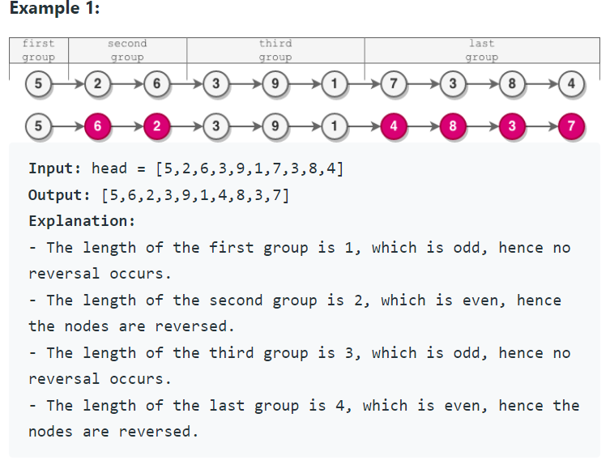
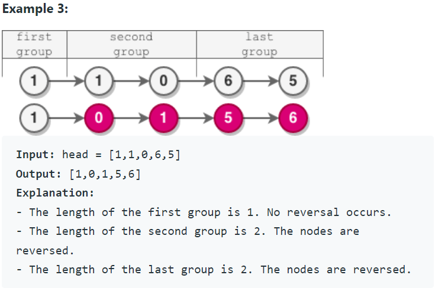

Problem Link : https://leetcode.com/problems/reverse-nodes-in-even-length-groups/

Problem Statement : You are given the head of a linked list.

The nodes in the linked list are sequentially assigned to non-empty groups whose lengths form the sequence of the natural numbers (1, 2, 3, 4, ...).<br> The length of a group is the number of nodes assigned to it. In other words,

The 1st node is assigned to the first group.<br>
The 2nd and the 3rd nodes are assigned to the second group.<br>
The 4th, 5th, and 6th nodes are assigned to the third group, and so on.<br>
Note that the length of the last group may be less than or equal to 1 + the length of the second to last group.


Reverse the nodes in each group with an even length, and return the head of the modified linked list.


<br>
<br>


-------------------------------------------------------------------------------------------------
### Solution : Thaka diya
Pre-requisite : Reverse LL in groups of k


```
class Solution {
public:
    int size(ListNode* head){
        if(!head) return 0;
        ListNode* t=  head;
        int cnt = 0;
        while(t){
            t = t->next;
            cnt++;
        }
        return cnt;
    }
    
    ListNode* reverse(ListNode* head, int k){
        if(k&1) return head;
        ListNode* curr = head;
        ListNode* tempHead = NULL;
        ListNode* tempTail = NULL;    
        for(int i=0;i<k;i++){
            head = head->next;
            if(tempHead == NULL){
                tempHead = tempTail = curr;
            }
            else{
                curr->next = tempHead;
                tempHead = curr;
            }
            curr = head;
        }
        tempTail->next = head;
        return tempHead;
    }
        
    ListNode* reverseEvenLengthGroups(ListNode* head) {
        int sz = size(head);
        int idx = 1;
        ListNode* t = head;
        ListNode* prev = NULL;
        int len = 1;
        while(t){
            if(len&1){
                for(int i=0;i<len&&t;i++){
                    prev= t;
                    t = t->next;
                    idx++;
                }
            }
            else{
                prev->next = reverse(t, len);
                prev = t;
                t = t->next;
                idx += len;
            }
            
            len = min(len+1, sz-idx + 1);
        }
        return head;
    }
};

TC : O(n)
SC : O(1)
```