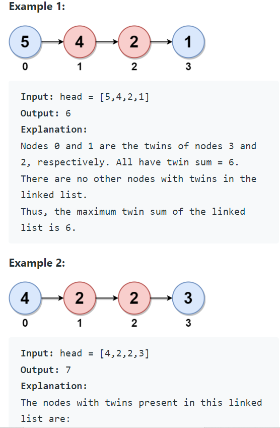

Problem Link : https://leetcode.com/problems/maximum-twin-sum-of-a-linked-list/

Problem Statement : In a linked list of size n, where n is even, the ith node (0-indexed) of the linked list is known as the twin of the (n-1-i)th node, if 0 <= i <= (n / 2) - 1.<br>

For example, if n = 4, then node 0 is the twin of node 3, and node 1 is the twin of node 2. These are the only nodes with twins for n = 4.<br>
The twin sum is defined as the sum of a node and its twin.<br>

Given the head of a linked list with even length, return the maximum twin sum of the linked list.<br>

<br>

________________________________________________________________________________________________
### Solution : Too easy

Pre-req : Recursive palindrome checking technique

```
class Solution {
public:
    
    void helper(ListNode* right, ListNode* &left, int &maxiSum){
        if(right == NULL) return;
        helper(right->next, left, maxiSum);
        maxiSum = max(maxiSum, right->val + left->val);
        left = left->next;
        
    }
    
    int pairSum(ListNode* head) {
        ListNode* left = head;
        int maxiSum = INT_MIN;
        helper(head, left, maxiSum);
        return maxiSum;
    }
};
```